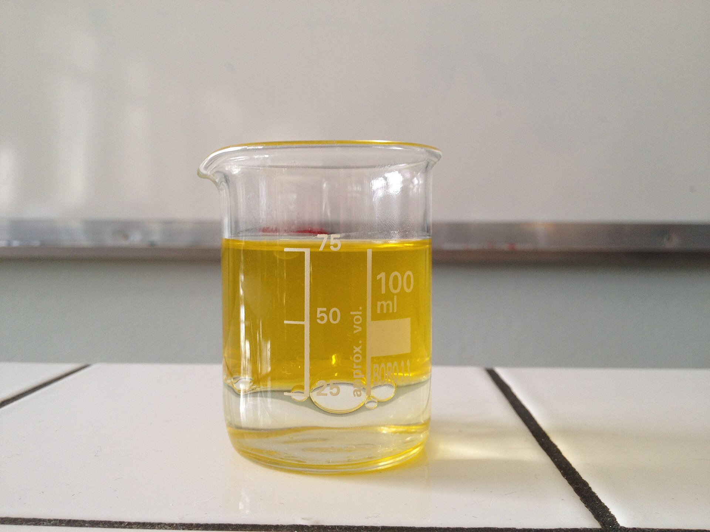

# S02 – Formuler une solution cosmétique stable 📝

**Solution – Solvant – Soluté – Dissolution – Solubilité – Miscibilité**

> En BTS MECP, on attend des réponses **rédigées**, **justifiées** et utilisant un **vocabulaire scientifique précis**.

---

## 🎯 Objectifs de la séance

À l'issue de cette séance, vous serez capables de :

- **définir** les termes : solution, solvant, soluté, dissolution
- **identifier** le solvant et les solutés dans une formulation cosmétique
- **expliquer** les facteurs qui influencent la solubilité
- **distinguer** miscibilité et solubilité
- **argumenter** sur la stabilité d'une solution cosmétique

---

## 🧴 Situation professionnelle

Vous travaillez dans un **laboratoire de formulation cosmétique**.

Un client souhaite développer une **lotion hydratante** contenant un nouvel **actif hydrosoluble** (acide hyaluronique). Avant de lancer la production, vous devez vous assurer que l'actif sera **correctement dissous** et que la formulation restera **stable** dans le temps.

> *« Comment garantir que l'actif sera bien dissous dans la phase aqueuse ? Quels paramètres surveiller ? »*

{.img-center width="50%"}

---

## 📄 Documents fournis

### Document 1 – Rappel : la lotion micellaire (S01)

Lors de la séance précédente, nous avons établi que la **lotion micellaire** est un **mélange homogène** : on ne distingue pas les différents constituants à l'œil nu.

En chimie, un mélange homogène liquide porte un nom spécifique : c'est une **solution**.

---

### Document 2 – Fiche technique : Acide hyaluronique (actif)

| Propriété | Valeur |
|-----------|--------|
| **Nom INCI** | Sodium Hyaluronate |
| **Masse molaire** | 400 000 – 1 000 000 g/mol (polymère) |
| **Aspect** | Poudre blanche |
| **Solubilité dans l'eau** | Très soluble (jusqu'à 50 g/L à 25°C) |
| **Solubilité dans l'huile** | Insoluble |
| **Solubilité dans l'éthanol** | Faiblement soluble |
| **pH de la solution à 1%** | 6,0 – 7,5 |
| **Conservation** | À l'abri de la lumière et de l'humidité |

---

### Document 3 – Solubilité de quelques substances dans l'eau

| Substance | Solubilité dans l'eau à 25°C | Solubilité dans l'eau à 60°C |
|-----------|------------------------------|------------------------------|
| Chlorure de sodium (sel) | 360 g/L | 370 g/L |
| Glucose | 910 g/L | 1 200 g/L |
| Acide citrique | 590 g/L | 840 g/L |
| Caféine | 20 g/L | 180 g/L |
| Vitamine C | 330 g/L | 450 g/L |

---

### Document 4 – Miscibilité de quelques liquides

| Liquide 1 | Liquide 2 | Observation | Conclusion |
|-----------|-----------|-------------|------------|
| Eau | Éthanol | Mélange uniforme | **Miscibles** |
| Eau | Glycérine | Mélange uniforme | **Miscibles** |
| Eau | Huile de tournesol | Deux couches distinctes | **Non miscibles** |
| Eau | Huile de paraffine | Deux couches distinctes | **Non miscibles** |
| Éthanol | Huile | Mélange uniforme | **Miscibles** |

---

### Document 5 – Schéma de la dissolution

```
    DISSOLUTION
    
    Soluté (solide)     +     Solvant (liquide)     →     Solution (mélange homogène)
    
    Exemple :
    Sel (NaCl)          +     Eau (H₂O)             →     Eau salée
    
    
    Le soluté "disparaît" visuellement mais il est toujours présent !
    → Les particules de soluté se dispersent entre les molécules de solvant.
```

---

## 🔬 Travail 1 – De mélange homogène à solution

### 1.1 – Rappel S01

1\. La lotion micellaire étudiée en S01 est-elle un mélange homogène ou hétérogène ?

☐ Homogène ☐ Hétérogène

2\. Justifiez en une phrase :

<br><br>

---

### 1.2 – Introduction du vocabulaire

À partir du **Document 1**, complétez les définitions :

**Solution** : Une solution est un _________________________ constitué d'un _________________________ et d'un ou plusieurs _________________________.

---

## 🧪 Travail 2 – Identifier solvant et soluté

### 2.1 – Définitions

À partir de vos connaissances et du contexte, complétez :

| Terme | Définition | Caractéristique |
|-------|------------|-----------------|
| **Solvant** | Constituant _________________________ | Souvent un _________________________ |
| **Soluté** | Constituant _________________________ | Peut être un solide, un liquide ou un _________________________ |

---

### 2.2 – Application à la lotion hydratante

On souhaite formuler une lotion hydratante avec la composition suivante :
- Eau purifiée : 95%
- Glycérine : 3%
- Acide hyaluronique : 1%
- Conservateur : 0,5%
- Parfum : 0,5%

1\. Quel est le **solvant** de cette formulation ? Justifiez.

<br><br><br>

2\. Citez **deux solutés** présents dans cette formulation :

- Soluté 1 : _________________________
- Soluté 2 : _________________________

3\. Pourquoi l'eau est-elle le solvant et non la glycérine ?

<br><br><br>

---

## 🔥 Travail 3 – Comprendre la dissolution

### 3.1 – Le phénomène de dissolution

À partir du **Document 5**, répondez aux questions :

1\. Lors de la dissolution, le soluté disparaît-il vraiment ?

☐ Oui, il est détruit ☐ Non, il est dispersé dans le solvant

2\. Expliquez avec vos mots ce qui se passe au niveau des particules lors d'une dissolution :

<br><br><br>

---

### 3.2 – Dissolution vs Fusion

Un étudiant affirme : *« Quand le sel se dissout dans l'eau, il fond. »*

Cette affirmation est-elle correcte ? Justifiez en distinguant **dissolution** et **fusion**.

<br><br><br><br>

---

## 📊 Travail 4 – Facteurs influençant la solubilité

### 4.1 – Influence de la température

À partir du **Document 3**, répondez aux questions :

1\. Pour la **caféine**, la solubilité est de _______ g/L à 25°C et de _______ g/L à 60°C.

2\. Comment évolue la solubilité de la caféine quand la température augmente ?

☐ Elle augmente ☐ Elle diminue ☐ Elle reste constante

3\. Cette tendance est-elle la même pour toutes les substances du tableau ?

☐ Oui ☐ Non

4\. **Conclusion** : Quel est l'effet général de la température sur la solubilité des solides dans l'eau ?

<br><br><br>

---

### 4.2 – Influence de la nature du solvant

À partir du **Document 2** (fiche technique de l'acide hyaluronique) :

1\. L'acide hyaluronique est-il soluble dans l'eau ? ☐ Oui ☐ Non

2\. L'acide hyaluronique est-il soluble dans l'huile ? ☐ Oui ☐ Non

3\. L'acide hyaluronique est-il soluble dans l'éthanol ? ☐ Oui ☐ Non ☐ Faiblement

4\. **Conclusion** : La solubilité dépend-elle de la nature du solvant ?

<br><br>

---

### 4.3 – Synthèse : les facteurs de solubilité

Complétez le schéma récapitulatif :

```
                    SOLUBILITÉ
                        │
        ┌───────────────┼───────────────┐
        │               │               │
   TEMPÉRATURE     NATURE DU       NATURE DU
        │           SOLVANT          SOLUTÉ
        │               │               │
        ▼               ▼               ▼
   Généralement    Eau ≠ Huile     Chaque substance
   ___________     ≠ Éthanol       a sa propre
   quand T°↑                       solubilité
```

---

## 💧 Travail 5 – Miscibilité vs Solubilité

### 5.1 – Distinguer les deux notions

À partir du **Document 4**, complétez le tableau :

| Notion | Concerne | Définition |
|--------|----------|------------|
| **Solubilité** | Un _____________ dans un liquide | Capacité d'un soluté à _____________ dans un solvant |
| **Miscibilité** | Deux _____________ | Capacité de deux liquides à former un _____________ |

---

### 5.2 – Application

1\. L'eau et l'éthanol sont-ils miscibles ? ☐ Oui ☐ Non

2\. L'eau et l'huile sont-elles miscibles ? ☐ Oui ☐ Non

3\. Si on veut incorporer un parfum (souvent huileux) dans une lotion aqueuse, quel problème risque-t-on de rencontrer ?

<br><br><br>

4\. Proposez une solution pour résoudre ce problème (plusieurs réponses possibles) :

☐ Ajouter un tensioactif / solubilisant
☐ Changer de forme galénique (huile au lieu de lotion)
☐ Chauffer très fort
☐ Utiliser un co-solvant (éthanol)

---

## ⚠️ Travail 6 – Stabilité d'une solution cosmétique

### 6.1 – Qu'est-ce qu'une solution stable ?

Une solution cosmétique est dite **stable** si elle reste _________________________ dans le temps (pas de _________________________, pas de _________________________, pas de _________________________).

---

### 6.2 – Cas pratique : problème de formulation

Un technicien prépare une lotion avec 5% de vitamine C dans l'eau. Après quelques jours, il observe un **dépôt blanc** au fond du flacon.

1\. La solution est-elle encore homogène ?

☐ Oui ☐ Non

2\. Quelle est la cause probable de ce dépôt ?

<br><br><br>

3\. Proposez **deux solutions** pour éviter ce problème :

- Solution 1 : _________________________________________________________________

- Solution 2 : _________________________________________________________________

---

## ✍️ Travail 7 – Entraînement E2 : rédaction argumentée

> 🎯 **Compétence E2 : Argumenter**

**Question** : L'acide hyaluronique (Document 2) est-il adapté pour une formulation en phase aqueuse ? Justifiez votre réponse en **3 à 5 lignes**.

Votre réponse doit :
- Citer une **donnée du document**
- Donner une **conclusion claire**
- **Justifier** avec un argument scientifique

<br><br><br><br><br><br>

---

## 🚀 Travail 8 – Approfondissement (pour aller plus loin)

> ⚡ Ce travail est **facultatif**.

### Situation : Choix d'un solvant

Un laboratoire souhaite formuler un produit contenant à la fois :
- Un actif **hydrosoluble** (vitamine C)
- Un actif **liposoluble** (vitamine E)

1\. Peut-on dissoudre ces deux actifs dans le même solvant (eau seule ou huile seule) ?

<br><br><br>

2\. Proposez une stratégie de formulation pour incorporer les deux actifs dans un même produit :

<br><br><br><br>

---

## ✍️ Synthèse personnelle (entraînement E2 – 5 à 7 lignes)

> 🎯 **Compétence E2 : Communiquer**

Rédigez un **court paragraphe** expliquant comment garantir qu'un actif sera bien dissous dans une formulation cosmétique.

**Votre synthèse doit contenir :**
- La définition de dissolution
- Les facteurs qui influencent la solubilité
- Le lien avec la stabilité du produit

**Mots obligatoires à placer :**
*solution – solvant – soluté – dissolution – solubilité – température – stable*

<br><br><br><br><br><br><br>

---

## ✅ Auto-évaluation

Avant de rendre votre travail, vérifiez :

| Critère | ✓ |
|---------|---|
| Je sais définir : solution, solvant, soluté, dissolution | ☐ |
| Je sais identifier le solvant et les solutés dans une formulation | ☐ |
| Je connais les facteurs qui influencent la solubilité | ☐ |
| Je sais distinguer miscibilité et solubilité | ☐ |
| J'ai rédigé mes réponses avec des phrases complètes | ☐ |
| J'ai rédigé ma synthèse avec les mots obligatoires | ☐ |

---

## 🔗 Pour la suite de la progression

Dans la **séance suivante (S03)**, nous apprendrons à **quantifier** les solutions :
- Qu'est-ce qu'une **concentration** ?
- Comment calculer la **concentration massique** ?
- Comment interpréter une concentration dans un contexte professionnel ?

---

## 🔧 Outils méthodologiques associés

➡️ [**Fiche méthode 01 – Justifier une réponse en physique-chimie**](../Methodologie/01_fiche_methode/)

➡️ [**Fiche méthode 02 – Calculer et interpréter une concentration**](../Methodologie/02_fiche_methode/)
