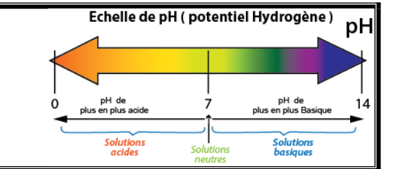

# S09 – Le pH : un paramètre clé du contrôle qualité 📝

**Acidité – Basicité – Échelle de pH – Mesure et interprétation**

> En BTS MECP, on attend des réponses **rédigées**, **justifiées** et utilisant un **vocabulaire scientifique précis**.
> Le pH est un critère de conformité incontournable pour tout produit cosmétique.

---

## 🎯 Objectifs de la séance

À l'issue de cette séance, vous serez capables de :

- **définir** le pH et son échelle de 0 à 14
- **classer** une solution comme acide, neutre ou basique
- **relier** le pH à la concentration en ions **H₃O⁺** (ions oxonium)
- **comprendre** que l’échelle de pH est **logarithmique** (variation par facteurs 10)
- **interpréter** une mesure de pH dans un contexte cosmétique
- **argumenter** sur la conformité d'un produit par rapport à son pH

---

## 🧴 Pourquoi c'est important pour votre métier ?

En institut ou en laboratoire cosmétique, vous serez amené(e) à :

- **Vérifier la compatibilité cutanée** d'un produit (pH physiologique de la peau ≈ 5,5)
- **Contrôler la conformité** d'un lot avant commercialisation
- **Comprendre pourquoi** certains produits irritent la peau (pH trop acide ou trop basique)
- **Conseiller vos clients** sur les produits adaptés à leur type de peau
- **Interpréter les fiches techniques** des matières premières

> 💡 *Savez-vous que le pH d'un shampooing "doux" est proche de 5,5 (celui de la peau) alors qu'un savon classique a un pH autour de 9-10 ? C'est pourquoi le savon peut assécher la peau : son pH perturbe le film hydrolipidique !*

👉 **Cette séance vous permettra** de comprendre ce paramètre essentiel et de l'utiliser pour évaluer la qualité d'un produit.

---

## 🧴 Situation professionnelle

Vous travaillez au **service contrôle qualité** d'un laboratoire cosmétique.

Avant de libérer un lot de **lotion tonique**, vous devez vérifier que son **pH** est conforme au cahier des charges. Un pH hors norme pourrait :

- irriter la peau des utilisateurs
- déstabiliser certains actifs de la formulation
- entraîner le rejet du lot

> *« Le pH mesuré est-il conforme ? Le produit est-il adapté à une application cutanée ? »*

---

## 📄 Documents fournis

### Document 1 – Définition du pH

Le **pH** (potentiel Hydrogène) est une grandeur qui caractérise l'**acidité** ou la **basicité** d'une solution aqueuse.

Le pH est lié à la **concentration en ions hydrogène H⁺** (aussi notés H₃O⁺ et appelés ions oxonium) présents dans la solution.

$$\boxed{pH = -\log[H_3O^+]}$$

**Remarque :** En BTS MECP, on n'utilise pas directement cette formule. On retient que :
- Plus [$H_3O^+$] est **élevée**, plus le pH est **bas** (solution acide)
- Plus [$H_3O^+$] est **faible**, plus le pH est **élevé** (solution basique)

> ✅ **À retenir (niveau BTS, sans calculs complexes)**
>
> - En solution aqueuse, on parle surtout des ions **H₃O⁺** (oxonium).
> - Le pH est une **échelle logarithmique** :
>   - si la concentration en **H₃O⁺** est multipliée par **10**, alors le pH **diminue de 1**.
>   - si la concentration en **H₃O⁺** est divisée par **10**, alors le pH **augmente de 1**.


---

### Document 2 – L'échelle de pH


Le pH s'exprime par un **nombre sans unité**, généralement compris entre **0 et 14** (à 25°C).

<p align="center">
  
</p>

| Domaine | Valeur du pH | Caractéristique |
|---------|:------------:|-----------------|
| **Acide** | pH < 7 | Excès d'ions H⁺ |
| **Neutre** | pH = 7 | Équilibre H⁺ / OH⁻ |
| **Basique** (ou alcalin) | pH > 7 | Excès d'ions OH⁻ |

---

### Document 3 – pH de quelques produits courants

| Produit | pH typique | Caractère |
|---------|:----------:|:---------:|
| Acide chlorhydrique (estomac) | 1 - 2 | Très acide |
| Jus de citron | 2 - 3 | Acide |
| Vinaigre | 2,5 - 3 | Acide |
| Soda / Cola | 2,5 - 3,5 | Acide |
| Jus d'orange | 3,5 - 4 | Acide |
| Peau saine | **4,5 - 5,5** | Légèrement acide |
| Eau pure | 7 | Neutre |
| Sang | 7,35 - 7,45 | Légèrement basique |
| Eau de mer | 8 - 8,5 | Basique |
| Savon de Marseille | 9 - 10 | Basique |
| Eau de Javel | 11 - 12 | Très basique |
| Soude caustique | 13 - 14 | Très basique |

---

### Document 4 – pH des produits cosmétiques

| Type de produit | pH recommandé | Justification |
|-----------------|:-------------:|---------------|
| **Lotion tonique** | 5,0 - 6,5 | Compatible avec le pH cutané |
| **Crème hydratante** | 5,0 - 7,0 | Respect du film hydrolipidique |
| **Shampooing doux** | 5,0 - 6,0 | Préserve la kératine du cheveu |
| **Gel douche** | 5,5 - 7,0 | Tolérance cutanée |
| **Savon liquide** | 5,5 - 8,0 | Variable selon formulation |
| **Peeling AHA** | 3,0 - 4,0 | Action exfoliante (acide) |
| **Permanente** | 8,5 - 9,5 | Ouverture des écailles du cheveu |
| **Coloration oxydante** | 9,0 - 11,0 | Pénétration du colorant |
| **Défrisant** | 12,0 - 14,0 | Action sur les ponts disulfures |

---

### Document 5 – Le pH physiologique de la peau

La peau possède un **film hydrolipidique** légèrement acide (pH ≈ 4,5 à 5,5) qui assure plusieurs fonctions :

- **Protection antimicrobienne** : les bactéries pathogènes se développent mal en milieu acide
- **Maintien de la flore cutanée** : les "bonnes" bactéries préfèrent ce pH
- **Fonction barrière** : cohésion des cellules de la couche cornée

**Conséquences pratiques :**

| Si le produit est... | Effet sur la peau |
|---------------------|-------------------|
| Trop acide (pH < 3) | Irritation, brûlure possible |
| Légèrement acide (pH 4-6) | Bien toléré, respect du film hydrolipidique |
| Neutre (pH 7) | Généralement bien toléré |
| Basique (pH > 8) | Perturbation du film, sécheresse possible |
| Très basique (pH > 10) | Irritation, altération de la barrière cutanée |

---

## 🔬 Travail 1 – Comprendre l'échelle de pH

### 1.1 – Classer des solutions

À partir du **Document 3**, classez les produits suivants dans le tableau :

| Acide (pH < 7) | Neutre (pH = 7) | Basique (pH > 7) |
|----------------|-----------------|------------------|
| | | |
| | | |
| | | |
| | | |

---

### 1.2 – Placer sur l'échelle

Placez les produits suivants sur l'échelle de pH :

**Produits à placer :** Eau pure – Jus de citron – Savon de Marseille – Peau saine – Eau de Javel

```
   0    1    2    3    4    5    6    7    8    9   10   11   12   13   14
   ├────┼────┼────┼────┼────┼────┼────┼────┼────┼────┼────┼────┼────┼────┤
   │                                                                      │
   │                                                                      │
   └──────────────────────────────────────────────────────────────────────┘
```

---

### 1.3 – Lien pH et ions H₃O⁺


Complétez les phrases avec « augmente », « diminue », « acide » ou « basique » :

1\. Quand le pH diminue, la concentration en ions **H₃O⁺** _________________.
2\. Quand le pH augmente, la concentration en ions **H₃O⁺** _________________.
3\. Une solution avec beaucoup d'ions **H₃O⁺** est _________________.
4\. Une solution avec peu d'ions **H₃O⁺** est _________________.

**Mini-question (échelle logarithmique) :**  
5. Si la concentration en **H₃O⁺** est multipliée par 10, le pH :
☐ augmente de 1 ☐ diminue de 1 ☐ ne change pas


---

## 📊 Travail 2 – pH et produits cosmétiques

> 🎯 **Compétence E2 : Interpréter** – Donner du sens à une valeur de pH.

### 2.1 – Analyse des produits

À partir du **Document 4**, répondez aux questions :

1\. Pourquoi le pH d'un shampooing doux est-il proche de 5,5 ?

<br><br><br>

2\. Pourquoi les produits de coloration ont-ils un pH basique (9-11) ?

<br><br><br>

3\. Pourquoi les peelings AHA ont-ils un pH acide (3-4) ?

<br><br><br>

---

### 2.2 – Choisir le bon produit

Une cliente a la peau sensible et réactive. Parmi les produits suivants, lequel lui conseilleriez-vous ?

| Produit | pH |
|---------|:--:|
| A – Nettoyant moussant | 9,2 |
| B – Eau micellaire | 5,5 |
| C – Savon surgras | 8,0 |

**Votre choix :** Produit _______

**Justification (3-4 lignes) :**

<br><br><br><br>

---

## 🧮 Travail 3 – Vérification de conformité

> 🎯 **Compétence E2 : Argumenter** – Justifier une décision de contrôle qualité.

### Situation

Le laboratoire a mesuré le pH d'une **lotion tonique** (lot n°2025-112).

**Résultats des mesures :**

| Mesure | 1 | 2 | 3 | 4 | 5 |
|--------|:-:|:-:|:-:|:-:|:-:|
| pH | 5,42 | 5,45 | 5,40 | 5,38 | 5,45 |

**Cahier des charges :** pH = 5,5 ± 0,5 (soit entre 5,0 et 6,0)

### Questions

**3.1** Calculez la moyenne des 5 mesures :

$$\bar{x} = \frac{5,42 + 5,45 + 5,40 + 5,38 + 5,45}{5} = \frac{.........}{5} = .........$$

**3.2** Identifiez les valeurs extrêmes et calculez l'étendue :

- pH_min = _______
- pH_max = _______
- Étendue E = pH_max - pH_min = _______

**3.3** La moyenne est-elle dans l'intervalle de conformité [5,0 ; 6,0] ?

☐ Oui ☐ Non

**3.4** Rédigez une conclusion professionnelle (méthode O.A.C.J.) :

> 🔒 **Méthode obligatoire (O.A.C.J.)**
> - **O (Observation)** : je cite la moyenne et l’intervalle du cahier des charges.
> - **A (Analyse)** : je compare (dans / hors intervalle).
> - **C (Conclusion)** : conforme / non conforme.
> - **J (Justification / décision CQ)** : je propose l’action (libérer / ajuster / rejeter) et je justifie (tolérance cutanée, sécurité, qualité).


**Observation :**

<br>

**Analyse :**

<br>

**Conclusion :**

<br>

**Justification :**

<br><br>

---

## 📈 Travail 4 – Interpréter un écart au pH cible

> 🎯 **Compétence E2 : Interpréter** – Analyser une déviation.

### Situation

Un lot de **gel douche** présente un pH de **7,8** alors que le cahier des charges indique **pH = 6,0 ± 0,5**.

### Questions

**4.1** Le lot est-il conforme ?

☐ Oui ☐ Non

Justifiez :

<br><br>

**4.2** Ce pH de 7,8 est-il :

☐ Acide ☐ Neutre ☐ Basique

**4.3** Quelles conséquences possibles sur la peau ? (Utilisez le Document 5)

<br><br><br>

**4.4** Quelles pourraient être les causes d'un pH trop élevé ? (Proposez 2 hypothèses)

<br><br><br>

**4.5** Quelle action recommandez-vous pour ce lot ?

☐ Libérer le lot tel quel

☐ Ajuster le pH avant libération

☐ Rejeter le lot

Justifiez votre choix :

<br><br><br>

---

## 🔄 Travail 5 – Exercice de synthèse (niveau E2)

> 🎯 **Compétence E2 : Argumenter et Communiquer**

### Situation professionnelle

Le laboratoire développe une **crème pour peaux sensibles**. Trois formulations sont testées :

| Formulation | pH mesuré | Observations |
|:-----------:|:---------:|--------------|
| A | 4,2 | Légère sensation de picotement signalée |
| B | 5,8 | Bonne tolérance, texture agréable |
| C | 8,5 | Sensation de tiraillement après application |

**Rappel :** pH physiologique de la peau = 4,5 à 5,5

### Questions

**5.1** Complétez le tableau d'analyse :

| Formulation | pH | Acide/Neutre/Basique | Compatible peau sensible ? |
|:-----------:|:--:|:--------------------:|:--------------------------:|
| A | 4,2 | | ☐ Oui ☐ Non |
| B | 5,8 | | ☐ Oui ☐ Non |
| C | 8,5 | | ☐ Oui ☐ Non |

**5.2** Quelle formulation recommandez-vous ? Justifiez en 4-5 lignes.

<br><br><br><br><br>

**5.3** Pour la formulation A, que pourrait-on faire pour améliorer la tolérance cutanée ?

<br><br><br>

---

## 🚀 Travail 6 – Approfondissement (pour aller plus loin)

> ⚡ Ce travail est **facultatif**.

### Le pouvoir tampon

Certaines solutions ont la capacité de **résister aux variations de pH** : on dit qu'elles ont un **pouvoir tampon**.

**Exemple :** La peau possède un pouvoir tampon grâce au mélange d'acides gras et de sueur (système tampon naturel).

**En cosmétique**, on ajoute souvent des **agents tampons** (ex : acide citrique / citrate de sodium) pour stabiliser le pH d'une formulation.

### Questions

1\. Pourquoi est-il important qu'un produit cosmétique ait un pH stable dans le temps ?

<br><br><br>

2\. Un produit cosmétique est stocké à 40°C pendant 3 mois (test de stabilité). Son pH passe de 5,5 à 6,8. Que peut-on en conclure ?

<br><br><br>

---

## ✍️ Synthèse personnelle (entraînement E2 – 5 à 7 lignes)

> 🎯 **Compétence E2 : Communiquer**

Rédigez un **court paragraphe** expliquant pourquoi le pH est un paramètre essentiel en cosmétique et comment l'utiliser pour évaluer la qualité d'un produit.

**Votre synthèse doit contenir :**
- La définition du pH et son échelle
- Le pH physiologique de la peau
- L'importance de la compatibilité cutanée
- L'utilisation en contrôle qualité

**Mots obligatoires à placer :**
*pH – acide – basique – peau – physiologique – conformité – cahier des charges*

<br><br><br><br><br><br><br>

---

## 🏆 Mes réussites aujourd'hui

Avant de passer à l'auto-évaluation, prenez un moment pour reconnaître vos progrès !

**Cochez ce que vous avez réussi à faire :**

| Réussite | ✓ |
|----------|---|
| J'ai compris l'échelle de pH (0-14) | ☐ |
| Je sais classer une solution en acide/neutre/basique | ☐ |
| Je connais le pH physiologique de la peau (4,5-5,5) | ☐ |
| J'ai su vérifier la conformité d'un pH | ☐ |
| J'ai su interpréter un écart de pH | ☐ |
| J'ai su argumenter un choix de produit | ☐ |

💡 **Chaque case cochée est une victoire !** Le pH est un outil simple mais puissant pour évaluer la qualité d'un produit.

---

## ✅ Auto-évaluation

Avant de rendre votre travail, vérifiez :

| Critère | ✓ |
|---------|---|
| Je sais définir le pH et son échelle | ☐ |
| Je sais si pH < 7 = acide et pH > 7 = basique | ☐ |
| Je connais le pH de la peau saine | ☐ |
| J'ai vérifié la conformité par rapport au cahier des charges | ☐ |
| J'ai justifié mes réponses avec des arguments | ☐ |
| J'ai rédigé ma synthèse avec les mots obligatoires | ☐ |

---

## 🔗 Pour la suite de la progression

Dans les **séances suivantes**, vous découvrirez :

- **S10** : Évaluation type E2 (bilan des notions installées sur les séances précédentes)
- **S14** : Acido-basicité appliquée à la cosmétique (couples, pKa, diagramme de prédominance)


---

## 🔧 Outils méthodologiques associés

➡️ [**Fiche méthode 01 – Justifier une réponse scientifique (O.A.C.J.)**](../Methodologie/01_fiche_methode/)

---

## 📺 Pour réviser en vidéo

🎬 **[Le pH, c'est quoi ? – Lumni](https://www.lumni.fr/video/le-ph)** – 3 min
*Définition et échelle de pH expliquées simplement.*

🎬 **[pH et cosmétiques – Formulation](https://www.youtube.com/watch?v=oKqZ2vwIXPc)** – 5 min
*Pourquoi le pH est crucial en formulation cosmétique.*

🎬 **[Mesurer le pH – Protocole](https://www.youtube.com/watch?v=rXbpWM4PNxE)** – 4 min
*Utilisation du pH-mètre (préparation au TP2).*

💡 **Conseil** : Regardez la vidéo sur la mesure du pH avant le TP2 pour vous familiariser avec le matériel !
