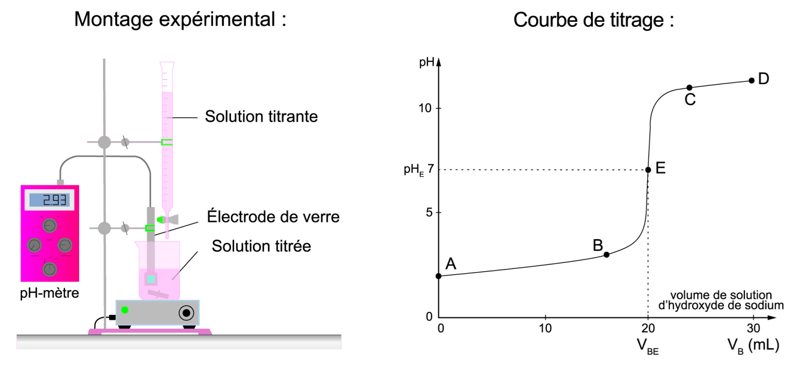
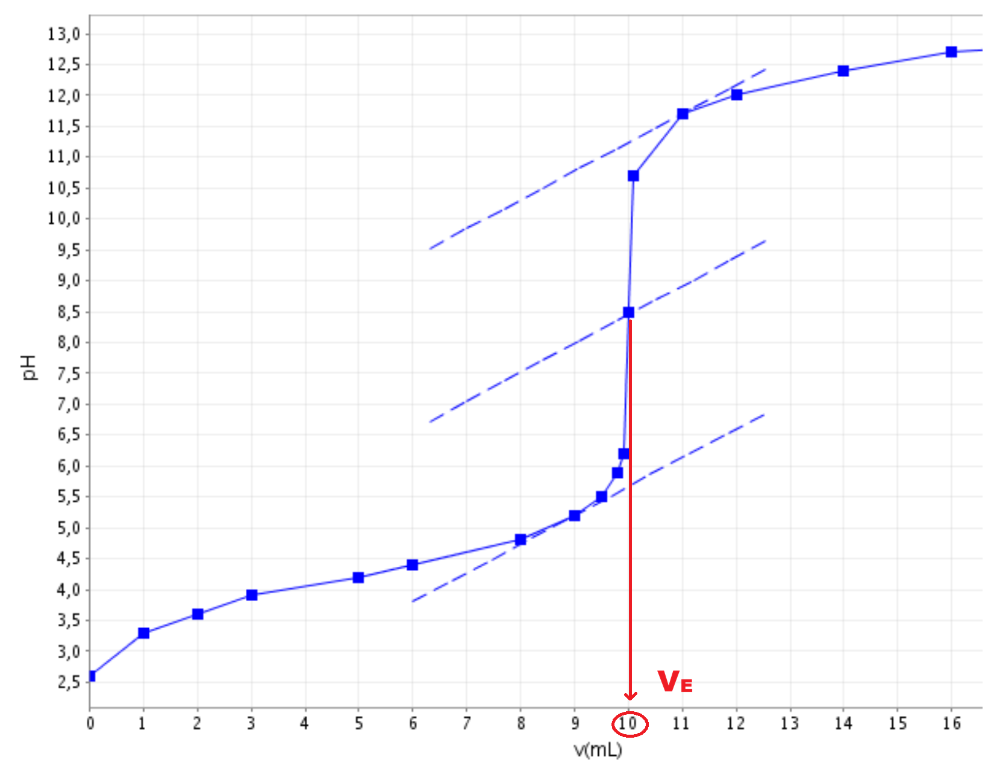

# Fiche méthode 07 🧠 – Exploiter un titrage acido-basique

**Compétences E2 : Analyser – Interpréter – Argumenter – Communiquer**

> Cette fiche vous guide pas à pas pour exploiter une courbe de titrage pH-métrique, comme vous le ferez à l'épreuve E2. À l'examen, vous ne réalisez **jamais** la manipulation : les résultats (courbe ou tableau) sont **fournis**.

---

## 🎯 Qu'est-ce qu'un titrage ?

Un **titrage** (ou dosage) est une méthode de mesure qui permet de déterminer la **concentration** ou la **quantité de matière** d'une espèce en solution.

En cosmétique, on titre par exemple :
- un **acide cosmétique** (acide glycolique, allantoïne) pour vérifier sa concentration
- un **conservateur** pour contrôler la conformité

### Principe

On ajoute progressivement une **solution titrante** (de concentration connue) dans la **solution titrée** (de concentration inconnue), et on suit l'évolution du pH.

---

## 📊 Étape 1 – Lire la courbe pH = f(V)

### Ce que vous recevez à l'examen

Une **courbe** ou un **tableau de valeurs** montrant le pH en fonction du volume de solution titrante ajouté.

### Trois zones à identifier



| Zone | Description | Signification chimique |
|:----:|-------------|----------------------|
| **Zone 1** de A à B | pH varie **lentement** (avant le saut) | L'espèce titrée est encore en excès |
| **Zone 2** de B à C | pH varie **rapidement** (saut) | On approche puis on dépasse l'équivalence |
| **Zone 3** de C à D| pH varie **lentement** (après le saut) | Le réactif titrant est en excès |

### Comment décrire la courbe (rédaction E2)

> *« La courbe présente trois zones : une première zone où le pH augmente lentement (de pH ≈ ... à pH ≈ ...), suivie d'un saut de pH brutal aux alentours de V = ... mL, puis une zone de stabilisation à pH élevé. Le saut de pH correspond au point d'équivalence. »*

---

## 📐 Étape 2 – Déterminer le volume à l'équivalence ($V_E$)

### Méthode 1 : Méthode des tangentes (graphique)

1. Tracer **deux tangentes** parallèles à la courbe : une avant le saut, une après le saut
2. Tracer la **droite parallèle** équidistante des deux tangentes
3. Le point d'intersection avec la courbe donne le **point d'équivalence**
4. Lire le volume correspondant : c'est **$V_E$**

{ width=70% .center }

### Méthode 2 : Méthode de la dérivée (numérique)

1. Calculer ΔpH/ΔV pour chaque intervalle du tableau
2. Repérer la **valeur maximale** de ΔpH/ΔV
3. Le volume correspondant est **$V_E$**

### Quelle méthode utiliser ?

| Situation | Méthode recommandée |
|-----------|:-------------------:|
| Courbe fournie (graphique) | Tangentes |
| Tableau de valeurs fourni | Dérivée |
| Les deux sont fournis | Au choix (préciser laquelle) |

```
┌─────────────────────────────────────────────────────────────┐
│                                                             │
│   📌 À L'EXAMEN :                                           │
│   On utilisera la méthode des tangentes.                    │
│   Toujours NOMMER la méthode utilisée                       │
│   et MONTRER le tracé ou le calcul sur le document          │
│                                                             │
└─────────────────────────────────────────────────────────────┘
```

---

## 🧮 Étape 3 – Exploiter l'équivalence

### La relation à l'équivalence

À l'équivalence, les quantités de matière des réactifs sont dans les **proportions stœchiométriques**.

Pour un titrage acide (AH) par une base (HO⁻), la réaction est :

$$AH + HO^- \rightarrow A^- + H_2O$$

À l'équivalence :

$$\boxed{n(AH) = n(HO^-) = C_{titrante} \times V_E}$$

### Méthode D.U.C.I. pour le calcul

| Étape | Action | Exemple |
|:-----:|--------|---------|
| **D** | Écrire la **Donnée** (formule) | n(AH) = C(NaOH) × V_E |
| **U** | Vérifier les **Unités** | C en mol/L, $V_E$ en L |
| **C** | Faire le **Calcul** numérique | n = 0,50 × 0,0120 = 6,0 × 10⁻³ mol |
| **I** | **Interpréter** le résultat | La quantité d'acide est de 6,0 mmol |

### Calcul de la concentration ou de la masse

**Si on cherche la concentration :**

$$\boxed{C_{titrée} = \frac{C_{titrante} \times V_E}{V_{titrée}}}$$

**Si on cherche la masse :**

$$\boxed{m = n \times M = C_{titrante} \times V_E \times M}$$

---

## 📝 Étape 4 – Conclure (posture E2)

### Structure de la conclusion

La conclusion doit toujours suivre la logique :

**Résultat → Comparaison → Décision**

| Étape | Ce qu'il faut écrire |
|:-----:|---------------------|
| **Résultat** | « La concentration (ou masse) obtenue est de ... » |
| **Comparaison** | « Le cahier des charges impose ... » ou « La valeur de référence est ... » |
| **Décision** | « Le produit est conforme / non conforme car ... » |

### Exemple de conclusion rédigée (niveau E2)

> *« Le titrage pH-métrique a permis de déterminer que la concentration en acide glycolique de la lotion est de 0,12 mol/L, soit une concentration massique de 9,1 g/L. Le cahier des charges impose une concentration de 10,0 ± 1,0 g/L. La valeur mesurée (9,1 g/L) est comprise dans l'intervalle de tolérance [9,0 ; 11,0 g/L]. Le lot est donc conforme et peut être libéré pour la commercialisation. »*

---

## ⚠️ Erreurs fréquentes à éviter

| Erreur | Correction |
|--------|------------|
| Oublier de convertir $V_E$ de mL en L | Toujours vérifier : V en **litres** dans la formule |
| Confondre solution titrante et solution titrée | Titrante = celle qu'on ajoute (burette) ; Titrée = celle dans le bécher |
| Donner un résultat sans unité | Toujours écrire l'unité (mol, g, mol/L, g/L) |
| Conclure sans comparer au cahier des charges | Le résultat seul ne suffit pas : il faut COMPARER |
| Écrire "le produit est bon" | Utiliser le vocabulaire professionnel : « conforme / non conforme » |

---

## 🔄 Les solutions tampons

### Définition

Une **solution tampon** est une solution dont le **pH varie peu** lors de l'ajout modéré d'un acide, d'une base, ou lors d'une dilution.

### Composition

Une solution tampon est constituée d'un **acide faible et de sa base conjuguée** en proportions voisines.

$$\boxed{\text{Tampon} = AH + A^- \quad (\text{même couple, mélangés})}$$

### Exemples en cosmétique

| Tampon | Composition | pH tampon | Usage |
|--------|:-----------:|:---------:|-------|
| Citrate | Acide citrique + citrate de sodium | ≈ 3–6 | Ajustement pH formulations |
| Lactate | Acide lactique + lactate de sodium | ≈ 3–5 | Soins hydratants |
| Phosphate | H₂PO₄⁻ + HPO₄²⁻ | ≈ 6–8 | Tampons biologiques |

### Rôle en cosmétique

| Fonction | Explication |
|----------|-------------|
| **Stabiliser le pH** | Le pH ne varie pas pendant le stockage |
| **Résister aux variations** | L'ajout d'un acide ou d'une base ne modifie pas significativement le pH |
| **Garantir l'efficacité** | Un actif pH-dépendant reste sous sa forme active |

### Lien avec le diagramme de prédominance

Un tampon fonctionne **au voisinage du pKa** du couple (pH ≈ pKa ± 1). C'est la zone où les deux formes (AH et A⁻) coexistent et peuvent « absorber » les variations.

```
┌─────────────────────────────────────────────────────────────┐
│                                                             │
│   📌 RECONNAÎTRE UN TAMPON :                               │
│                                                             │
│   • Contient un acide faible ET sa base conjuguée           │
│   • pH ≈ pKa (± 1)                                          │
│   • Le pH est stable lors d'ajouts modérés                  │
│                                                             │
└─────────────────────────────────────────────────────────────┘
```

---

## ✅ Checklist E2 – Titrage

Avant de rendre votre copie, vérifiez :

| Critère | ✓ |
|---------|---|
| J'ai décrit l'allure de la courbe (3 zones) | ☐ |
| J'ai nommé la méthode utilisée pour trouver $V_E$ | ☐ |
| J'ai lu $V_E$ correctement (avec l'unité) | ☐ |
| J'ai écrit la relation à l'équivalence | ☐ |
| J'ai converti $V_E$ en litres avant de calculer | ☐ |
| J'ai suivi la méthode D.U.C.I. | ☐ |
| J'ai comparé mon résultat au cahier des charges | ☐ |
| J'ai conclu avec le vocabulaire professionnel | ☐ |
