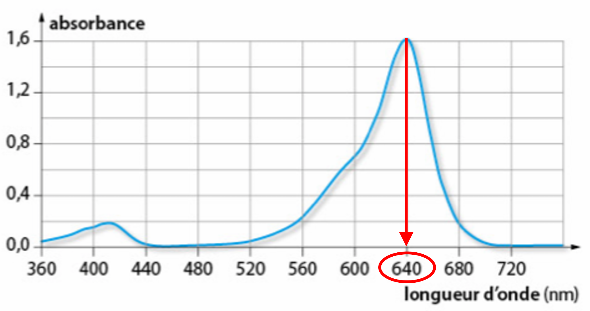
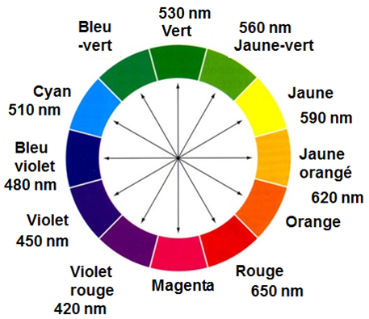

# Fiche méthode 09 🧠 – Lire un spectre (UV/Visible, irradiance)

**Compétences E2 : Analyser – Interpréter – Argumenter**

> Cette fiche vous guide pour exploiter les documents spectraux que vous rencontrerez à l'épreuve E2 : spectres d'absorption UV/Visible, spectres d'irradiance, et courbes d'absorbance. Vous ne réalisez **jamais** la mesure : les données sont **fournies**.

---

## 🎯 Qu'est-ce qu'un spectre ?

Un **spectre** est une représentation graphique qui montre comment une grandeur physique (absorbance, irradiance, transmittance…) **varie en fonction de la longueur d'onde** (λ).

En cosmétique, les spectres servent à :
- **Vérifier la conformité** d'un produit (concentration d'un actif)
- **Caractériser la protection** d'un filtre solaire (absorption UV)
- **Comprendre la couleur** d'un produit ou d'un colorant
- **Contrôler la qualité** d'un appareil (LED, lampe UV)

---

## 📋 Les ondes électromagnétiques : rappel essentiel

### Le spectre électromagnétique

```
   UV-C     UV-B     UV-A     VISIBLE           IR
  100 nm   280 nm   315 nm   400 nm          780 nm        λ
    │────────│────────│────────│─────────────────│────────────►
    │        │        │        │   V B V J O R   │
    │        │        │        │                 │
  Germicide Coup de  Bronze   Couleurs perçues  Chaleur
            soleil   âge      par l'œil
```

### Grandeurs fondamentales

| Grandeur | Symbole | Unité | Relation |
|----------|:-------:|:-----:|:--------:|
| Longueur d'onde | λ | nm (nanomètre) | — |
| Fréquence | f (ou ν) | Hz | λ = c / f |
| Célérité (lumière dans le vide) | c | m/s | c = 3,00 × 10⁸ m/s |
| Énergie du photon | E | J (ou eV) | E = h × f |

```
┌─────────────────────────────────────────────────────────────┐
│                                                             │
│   📌 RÈGLE CLÉ :                                           │
│                                                             │
│   Plus λ est PETIT → plus l'énergie est GRANDE              │
│   UV-C (100 nm) >> UV-A (400 nm) >> IR (> 780 nm)           │
│                                                             │
│   C'est pourquoi les UV-B/C sont les plus dangereux         │
│                                                             │
└─────────────────────────────────────────────────────────────┘
```

---

## 📊 Type 1 – Spectre d'absorption UV/Visible

### Ce que vous recevez à l'examen

Un graphique **Absorbance = f(λ)** montrant à quelles longueurs d'onde une substance absorbe la lumière.

### Comment le lire



On note que l'absorbance maximale ici $λ_{max}$ = $640 \ \ nm$

### Informations à extraire

| Élément | Comment le trouver | Ce que ça signifie |
|---------|:------------------:|-------------------|
| **$λ_{max}$** | Abscisse du pic le plus haut | Longueur d'onde préférentiellement absorbée |
| **Largeur du pic** | Étendue de la bande d'absorption | Zone spectrale couverte |
| **Domaine** | UV-C, UV-B, UV-A, visible ? | Type de protection ou couleur |

### Application : filtres solaires

| Filtre | λ_max | Domaine | Protection |
|--------|:-----:|:-------:|:----------:|
| Filtre UV-B | ≈ 310 nm | UV-B | Anti-coup de soleil |
| Filtre UV-A | ≈ 360 nm | UV-A | Anti-vieillissement |
| Filtre large spectre | 290–400 nm | UV-B + UV-A | Protection complète |

### Rédaction E2

> *« Le spectre d'absorption du filtre X présente un maximum d'absorption à λ_max = 310 nm, situé dans le domaine UV-B (280-315 nm). Ce filtre absorbe donc principalement les UV-B, responsables des coups de soleil. Cependant, son absorption est faible dans le domaine UV-A (315-400 nm), ce qui limite la protection contre le vieillissement photo-induit. »*

---

## 📊 Type 2 – Loi de Beer-Lambert (absorbance et concentration)

### La loi

$$\boxed{A = \varepsilon \times \ell \times C}$$

| Symbole | Grandeur | Unité |
|:-------:|----------|:-----:|
| A | Absorbance | sans unité |
| ε | Coefficient d'extinction molaire | L·mol⁻¹·cm⁻¹ |
| ℓ | Épaisseur de la cuve (trajet optique) | cm |
| C | Concentration molaire | mol·L⁻¹ |

### Conditions de validité

- Solution **diluée** (A < 2, idéalement A < 1)
- Solution **limpide** (pas de trouble)
- Lumière **monochromatique** (une seule λ, choisie = λ_max)

### Exploitation graphique : droite A = f(C)


### Méthode pour déterminer une concentration inconnue

1. **Tracer** la droite d'étalonnage A = f(C) avec les solutions étalons
2. **Mesurer** l'absorbance $A_S$ de la solution inconnue
3. **Reporter** $A_S$ sur le graphique → lire $C_S$ sur l'axe des abscisses
4. **Vérifier** que $C_S$ est dans le domaine de linéarité

**OU par calcul :**

$$\boxed{C_S = \frac{A_S}{\varepsilon \times \ell}}$$

### Rédaction E2

> *« La droite d'étalonnage A = f(C) est linéaire et passe par l'origine, ce qui confirme que la loi de Beer-Lambert est vérifiée dans ce domaine de concentration. L'absorbance de la solution inconnue est $A_S$ = 0,65. Par report graphique, on détermine $C_S$ = 0,045 mol/L. Cette concentration correspond à une concentration massique de 3,4 g/L, conforme au cahier des charges [3,0 – 4,0 g/L]. »*

---

## 📊 Type 3 – Spectre d'irradiance (appareils)

### Ce que c'est

Un spectre d'**irradiance** (ou spectre d'émission) montre **ce qu'émet** une source lumineuse (lampe UV, LED, soleil…) en fonction de la longueur d'onde.

### Ce que vous recevez à l'examen

Un graphique **Irradiance = f(λ)** (en W/m² ou mW/cm²).

### Comment le lire

| Élément | Ce que ça signifie |
|---------|-------------------|
| **Pic principal** | Longueur d'onde la plus intense émise |
| **Largeur d'émission** | Gamme spectrale couverte |
| **Domaine** | UV-C/B/A, visible, IR → danger et usage |

### Applications en cosmétique

| Appareil | Domaine d'émission | Usage |
|----------|:------------------:|-------|
| Lampe UV-A (36W) | 340–400 nm | Polymérisation vernis semi-permanent |
| LED UV (405 nm) | ≈ 405 nm (étroit) | Polymérisation vernis LED |
| Lampe Wood | 365 nm | Diagnostic cutané |
| LED rouge | 620–640 nm | Photo-rajeunissement |
| LED bleue | 415–420 nm | Anti-acné (action antibactérienne) |

### Rédaction E2

> *« Le spectre d'émission de la lampe LED présente un pic étroit centré à 405 nm, dans le domaine UV-A proche / visible violet. Cette longueur d'onde est adaptée à la polymérisation des résines de vernis gel. Le spectre montre une absence d'émission dans les domaines UV-B et UV-C, ce qui limite le risque pour la peau de la cliente lors de l'utilisation en institut. »*

---

## 🎨 Lien couleur ↔ absorption (visible)

### Principe

Un objet qui **absorbe** une couleur apparaît de la **couleur complémentaire**.

### Cercle chromatique simplifié

| Couleur absorbée | λ absorbée (nm) | Couleur perçue (complémentaire) |
|:----------------:|:---------------:|:-------------------------------:|
| Violet | 380–450 | Jaune-vert |
| Bleu | 450–490 | Orange |
| Vert | 490–560 | Rouge-violet |
| Jaune | 560–590 | Bleu-violet |
| Orange | 590–630 | Bleu |
| Rouge | 630–780 | Bleu-vert (cyan) |

### Application

> Si un colorant capillaire absorbe à $λ_{max}$ = 480 nm (bleu), il apparaît **orange**.

```
┌─────────────────────────────────────────────────────────────┐
│                                                             │
│   📌 ASTUCE :                                              │
│                                                             │
│   Couleur vue = couleur COMPLÉMENTAIRE de celle absorbée    │
│   (diamétralement opposée sur le cercle chromatique)        │
│                                                             │
└─────────────────────────────────────────────────────────────┘
```



---

## ⚠️ Erreurs fréquentes

| Erreur | Correction |
|--------|------------|
| Confondre absorption et émission | Absorption = ce que la substance RETIENT ; Émission = ce que la source ÉMET |
| Lire λ_max sur l'axe des ordonnées | λ_max se lit sur l'axe des **abscisses** (longueurs d'onde) |
| Confondre absorbance et transmittance | A élevée = absorbe beaucoup = transmit peu (T = 10⁻ᴬ) |
| Oublier les unités de C dans Beer-Lambert | C en **mol/L** (pas en g/L, sauf si ε est adapté) |
| Conclure sans comparer à une référence | Toujours comparer au cahier des charges ou à une norme |
| Dire "la lampe absorbe les UV" | La lampe **émet** ; c'est le filtre solaire qui **absorbe** |

---

## ✅ Checklist E2 – Spectres

### Pour un spectre d'absorption

| Critère | ✓ |
|---------|---|
| J'ai identifié λ_max (abscisse du pic) | ☐ |
| J'ai situé λ_max dans le bon domaine (UV-C/B/A, visible) | ☐ |
| J'ai relié le domaine à une propriété cosmétique | ☐ |
| J'ai comparé à une référence ou un cahier des charges | ☐ |

### Pour Beer-Lambert

| Critère | ✓ |
|---------|---|
| J'ai vérifié les conditions de validité (A < 2, solution limpide) | ☐ |
| J'ai lu ou calculé C correctement (unités !) | ☐ |
| J'ai converti en concentration massique si demandé (Cm = C × M) | ☐ |
| J'ai comparé au cahier des charges et conclu | ☐ |

### Pour un spectre d'irradiance

| Critère | ✓ |
|---------|---|
| J'ai identifié le pic d'émission principal | ☐ |
| J'ai situé le domaine d'émission | ☐ |
| J'ai relié à l'usage de l'appareil | ☐ |
| J'ai évalué le risque éventuel (UV-B/C émis ?) | ☐ |
