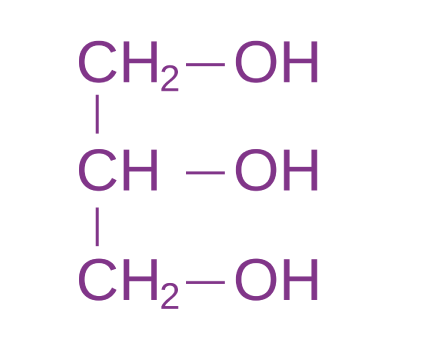
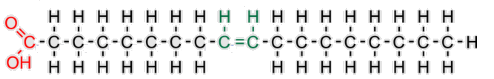
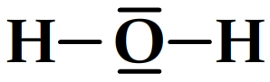
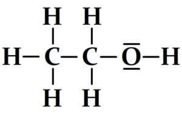

# TP 3 – Dossier moléculaire : choix d’actifs/excipients 🧴🧪  
**Documents fournis → analyse → interprétation → argumentation → décision (logique E2)**

---

## 🕒 Cadre de travail

👥 Travail : individuel puis mise en commun courte  

📌 **Consigne générale :**  
Vous devez analyser **tous les actifs A, B, C et D** (tableau de synthèse complet).  
Puis vous **choisissez 1 actif** (au choix) pour réaliser la **synthèse détaillée** (conclusion E2-like).

**Actif choisi pour la synthèse (A / B / C / D) :** ________

---

## 🎯 Objectifs (S15 – TP3)

- Exploiter un **dossier moléculaire** pour choisir un **actif** et, si besoin, un **excipient** (solubilisant / co-solvant / tensioactif)  
- Lire une **Lewis fournie** (H₂O + éthanol) pour identifier :

  - doublets non liants
  - donneur / accepteur de liaison H

- Relier : **structure → polarité → interactions → propriété → décision de formulation**

---

## 🧠 Compétences travaillées (E2)

- Lire un document scientifique (représentations moléculaires)
- Interpréter : polarité / interactions et conséquences formulatoires
- Argumenter : justification structurée, appuyée sur les documents
- Décider : recommandation professionnelle cohérente

---

## 🧴 Contexte professionnel

Un laboratoire cosmétique étudie plusieurs **actifs** susceptibles d’être intégrés dans une **formulation aqueuse** ou **huileuse**.

Les fiches techniques fournissent des représentations moléculaires et des repères sur les interactions.

Le laboratoire souhaite déterminer :
- l’**affinité** des actifs avec l’eau,
- les **interactions possibles**,
- la **phase** la plus cohérente (aqueuse / huileuse),
- et, en cas d’incompatibilité, le **type d’excipient** à privilégier.

---

## 📄 Documents fournis (sommaire)

- Document 1 : Représentations moléculaires de plusieurs actifs cosmétiques  
- Document 2 : Lewis fournie (H₂O + éthanol) + repères “liaison H”  
- Document 3 : Polarité et répartition des charges (repères)  
- Document 4 : Interactions moléculaires possibles (repères)  
- Document 5 : Extrait de dossier de formulation (phase aqueuse)

---

## 🧪 Partie A – Lecture des représentations (COMPRENDRE)

### 1️⃣ Nature des représentations (Document 1)

1\. Identifier le type de représentation utilisé pour les actifs A/B/C/D (doc 1).  
   (formule semi-développée, écriture simplifiée, description qualitative…)

    

🔎 *Compétences travaillées : lire un document scientifique – identifier*

2\. Pour **chaque actif (A, B, C, D)**, relever **2 indices microscopiques** utiles (ex : –OH, –COOH, O/N, chaîne carbonée longue…).  

A : ____________________________________________  
B : ____________________________________________  
C : ____________________________________________  
D : ____________________________________________  

   

🔎 *Compétences travaillées : analyser un document – sélectionner l’information pertinente*

---

## 🧪 Partie B – Lire une Lewis fournie (H₂O + éthanol) (INTERPRÉTER)

### 2️⃣ Lewis : doublets / donneur-accepteur / liaison H (Document 2)

3\. Sur la Lewis de H₂O, indiquer :

- le nombre de **doublets non liants** sur l’oxygène : ______  
- H₂O peut être **donneur** de liaison H : ☐ oui ☐ non  
- H₂O peut être **accepteur** de liaison H : ☐ oui ☐ non  

🔎 *Compétences travaillées : lire une représentation microscopique – interpréter*

4\. Sur la Lewis de l’éthanol, entourer (ou citer) le groupement responsable des interactions avec l’eau : __________

🔎 *Compétences travaillées : lire une représentation microscopique – identifier*

5\. Éthanol : donneur / accepteur de liaison H ? (cocher)  

- Donneur : ☐ oui ☐ non  
- Accepteur : ☐ oui ☐ non  

Justifier en 1 phrase à partir de la Lewis fournie.  
    

🔎 *Compétences travaillées : interpréter – justifier à partir d’un document*

6\. Conclure : l’éthanol est-il plutôt :

☐ hydrophile ☐ lipophile ☐ intermédiaire (“mixte”)  
Justifier en 2 lignes.  
    

🔎 *Compétences travaillées : interpréter – relier structure et propriété*

---

## 🧪 Partie C – Polarité et interactions des actifs (INTERPRÉTER)

### 3️⃣ Polarité des actifs (Document 3)

7\. Compléter pour **A, B, C, D** : polarité globale attendue (1 mot + 1 justification courte).

- A : ☐ hydrophile ☐ lipophile ☐ mixte  
  Justification (1 phrase) : ________________________________________

  

- B : ☐ hydrophile ☐ lipophile ☐ mixte  
  Justification (1 phrase) : ________________________________________

  

- C : ☐ hydrophile ☐ lipophile ☐ mixte  
  Justification (1 phrase) : ________________________________________

  

- D : ☐ hydrophile ☐ lipophile ☐ mixte  
  Justification (1 phrase) : ________________________________________

  

🔎 *Compétences travaillées : interpréter – argumenter brièvement*

8\. Expliquer en 3–5 lignes le lien : **polarité → interactions avec l’eau → dispersion/stabilité**.  
      

🔎 *Compétences travaillées : relier microscopique et macroscopique – communiquer*

---

## 4️⃣ Interactions possibles avec l’eau (Document 4)

9\. Pour chaque actif, indiquer les interactions possibles avec l’eau (cocher) :

| Actif | London | Dipôle–dipôle | Liaison H |
|------|:------:|:-------------:|:---------:|
| A | ☐ | ☐ | ☐ |
| B | ☐ | ☐ | ☐ |
| C | ☐ | ☐ | ☐ |
| D | ☐ | ☐ | ☐ |

 

🔎 *Compétences travaillées : analyser – interpréter*

10\. Expliquer en 4–6 lignes pourquoi un actif **lipophile** se disperse mal dans l’eau (références : interactions eau–eau vs eau–actif).  
       

🔎 *Compétences travaillées : interpréter – argumenter*

---

## 🧪 Partie D – Exploitation E2 : argumenter et décider (E2-like)

### 5️⃣ Exploitation d’un extrait de dossier (Document 5)

11\. Quel actif du document 1 correspond **le mieux** à l’extrait du document 5 ?
☐ A ☐ B ☐ C ☐ D  

Justifier avec **au moins 2 arguments** (groupements, polarité, interactions…).  
      

🔎 *Compétences travaillées : exploiter des documents – argumenter*

---

### 6️⃣ Synthèse (E2-like) sur l’actif choisi (A/B/C/D)

📌 **Vous répondez aux questions 12 et 13 uniquement pour l’actif que vous avez choisi pour la synthèse.**

12\. Rédiger une **conclusion argumentée** (6 à 8 lignes) :

> **Cet actif est-il plus adapté à une formulation aqueuse ou huileuse ?**

Contraintes :
- exploiter **au moins 2 documents**,
- mobiliser : **polarité + interactions**,
- proposer un **choix professionnel** clair.

        

🔎 *Compétences travaillées : argumenter – décider (posture E2)*

13\. Si l’actif choisi est **lipophile** mais doit être intégré à une lotion aqueuse, proposer un **type d’excipient** (1 seul) et justifier (3–4 lignes) :  
☐ solubilisant ☐ co-solvant ☐ tensioactif / émulsifiant  

     

🔎 *Compétences travaillées : proposer une solution technique – justifier*

---

## ✅ Tableau de synthèse 

Compléter le tableau pour **A, B, C et D**.

| Actif | Indices microscopiques (2) | Polarité globale | Interactions possibles avec l’eau | Phase cohérente | Excipient si besoin | Justification (2 lignes) |
|------|-----------------------------|------------------|-----------------------------------|-----------------|---------------------|--------------------------|
| A | | | | | | |
| B | | | | | | |
| C | | | | | | |
| D | | | | | | |

---

## 🧠 Posture E2 – À retenir

- On **s’appuie sur les documents** : on ne devine pas.
- On relie toujours : **microscopique → propriété → décision pro**.
- Une Lewis peut être **fournie** : on attend sa **lecture** (doublets / donneur-accepteur / liaison H), pas sa construction.

---

## 📚 Dossier documentaire

### 📄 Document 1 – Représentations moléculaires de plusieurs actifs cosmétiques

#### 🧴 Actif A – Glycérine (fortement hydrophile)

{ width=50% .center}

#### 🧴 Actif B – Éthanol (faiblement polaire)

{ width=40% .center}

#### 🧴 Actif C – Acide gras (type acide oléique : globalement lipophile)

{ width=80% .center}

#### 🧴 Actif D – Actif polyfonctionnel (ex : allantoïne : très polaire)

Repère qualitatif : plusieurs atomes **O/N** et plusieurs groupements capables d’établir des **liaisons hydrogène**.

---

### 📄 Document 2 – Lewis fournie : H₂O et éthanol + repère liaison H

#### A – Lewis de H₂O (fournie)

{ width=40% .center}

#### B – Lewis simplifiée de l’éthanol (fournie)

Repère : une **liaison hydrogène** est possible si :

* un H est lié à **O** ou **N** (donneur),
* et une autre molécule possède un **O** ou **N** avec **doublet non liant** (accepteur).

---

### 📄 Document 3 – Polarité : repères

* Molécule polaire : répartition inégale des charges (δ⁻ / δ⁺), atomes O/N…
* Molécule peu/non polaire : majoritairement C–C/C–H
* Molécule “mixte” : une partie polaire + une partie apolaire

---

### 📄 Document 4 – Interactions moléculaires : repères

* London : interactions faibles, nombreuses → cohésion
* Dipôle–dipôle : entre molécules polaires
* Liaison hydrogène : O–H / N–H + O/N (doublets) → solubilité/cohésion/texture

---

### 📄 Document 5 – Extrait de dossier de formulation

> *« L’actif étudié présente une bonne affinité avec la phase aqueuse.
> Cette affinité est liée à la présence de groupements polaires au sein de la molécule, favorisant les interactions avec les molécules d’eau.
> Ces interactions contribuent à une bonne dispersion de l’actif dans la formulation et participent à la stabilité physique du produit. »*

---

## 🔗 Méthode

➡️ [Fiche méthode 05 – Lire une représentation microscopique (E2)](https://bts-mecp-physique-chimie-688080.forge.apps.education.fr/Methodologie/05_fiche_methode/)
➡️ [Fiche méthode 01 – Justifier une réponse scientifique (E2)](https://bts-mecp-physique-chimie-688080.forge.apps.education.fr/Methodologie/01_fiche_methode/)

---
