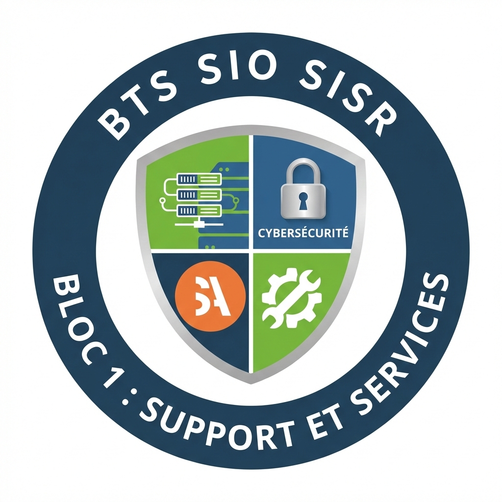

# BLOC 3 - Cybersécurité - BTS SIO1

**SUP'ADOUR - MFR de Pontonx**

  

---

Bienvenue sur l'espace de ressources du BTS Services Informatique aux organisations Spécialité SISR.

# 🔐 BTS SIO – Option SISR  
## Bloc 3 : Cybersécurité — Année 1

> 🛡️ *Comprendre les menaces, appliquer les bonnes pratiques, sécuriser les données et respecter le cadre légal (RGPD).*

---

## 🎯 Objectifs de l’année 1 (Bloc 3)

En première année, l’objectif est de construire un **socle cybersécurité solide** :

- Adopter une **hygiène numérique** et des pratiques sûres (mots de passe, mises à jour, sauvegardes)
- Comprendre les **menaces courantes** (malwares, phishing, ransomware…)
- Maîtriser les **bases RGPD** : notions, acteurs, droits, obligations, violations
- Développer une **culture sécurité** utile pour les projets d’infrastructure (réseau/systèmes) et les épreuves

> Référentiel de progression utilisé : colonne **“BLOC 3 – Cybersécurité (4h)”** du plan Année 1 (S1 → S20). :contentReference[oaicite:0]{index=0}

---

## 🗓️ Déroulé de l’année (Année 1) — Progression par semaines

> Le tableau ci-dessous reprend **toutes les séances S1 à S20** de l’Année 1 pour le Bloc 3 Cybersécurité. :contentReference[oaicite:1]{index=1}

| Phase | Sem. | Thèmes / notions (Bloc 3) | Activités / productions attendues |
|------:|:----:|----------------------------|-----------------------------------|
| **Phase 1 – Découverte & fondamentaux** | **S1** | **Hygiène numérique** : 10 règles essentielles (ANSSI grand public). **Exemples d’attaques** : ransomware, phishing (cas médiatisés). | Mini-débat + repérage des risques ; fiche “10 règles” personnalisée. |
|  | **S2** | **Menaces courantes** : virus, ver, trojan, ransomware, spyware (définitions + exemples). **Mises à jour** : OS/logiciels/antivirus, enjeux. | Carte mentale “menaces” + check-list de mise à jour poste. |
|  | **S3** | **Mots de passe** : bonnes pratiques, gestionnaires. **Authentification** : ce que je sais / ce que j’ai / ce que je suis, **MFA**. | Atelier : évaluer des mots de passe + scénario MFA (pro/contraintes). |
|  | **S4** | **Sauvegardes** : complète, différentielle, incrémentielle — **règle 3-2-1**. **Supports amovibles** : risques et bonnes pratiques. | Schéma de stratégie de sauvegarde d’une PME + politique USB. |
|  | **S5** | **RGPD – Début MOOC CNIL** : donnée personnelle, acteurs, obligations. | Quiz + exemples : données perso dans un SI (classement). |
| **Phase 2 – Services réseau, administration & RGPD** | **S6** | **RGPD – Module 2** : collecte, consentement, transparence. **Droits** : accès, rectification, opposition, portabilité. | Cas pratique : formulaire de collecte conforme / non conforme. |
|  | **S7** | **RGPD – Module 3** : durées de conservation, sécurisation des données. **Violations** : notification CNIL, exemples. | Tableau “durées de conservation” + procédure simplifiée de notification. |
|  | **S8** | **RGPD – Module 4** : travail & données perso, vidéosurveillance. **Cisco Cyber (début)** : Introduction à la cybersécurité (modules + quiz). | Synthèse “travail & RGPD” + lancement parcours Cisco (score quiz). |
|  | **S9** | **Cisco Cyber (suite)** : modules en ligne + quiz. **RGPD – Étude de cas** : analyser une violation de données (mini-cas). | Compte rendu d’incident : faits / risques / obligations / actions. |
|  | **S10** | **Cisco Cyber (validation)** : passage certification (ou validation interne). **Droits d’accès** : moindre privilège, matrice de droits. | Matrice de droits (service/ressource) + bilan parcours Cisco. |
| **Phase 3 – Windows Server, services avancés & scripting** | **S11** | **Cryptographie symétrique** : principe, clé secrète, **AES**. **TP** : chiffrer/déchiffrer un fichier (openssl ou GPG). | Fiche procédure + démonstration (preuve chiffrement/déchiffrement). |
|  | **S12** | **RGPD – PIA** : méthode d’analyse d’impact. **TP** : mini-PIA sur cas fictif. | Mini-PIA structuré : contexte / risques / mesures. |
|  | **S13** | **Certificats numériques** : PKI, autorité de certification, **X.509**. **TP** : générer certificat auto-signé (openssl). | Certificat + explication usages/limites (auto-signé vs CA). |
|  | **S14** | **VPN – concepts** : tunnelisation, types (site-à-site, nomade). **Asymétrique** : clé publique/privée (principes). | Schémas comparatifs VPN + synthèse asymétrique (cas d’usage). |
|  | **S15** | **Identité numérique** : e-réputation, droit à l’image, pseudonymat. **Sécurité BIOS/UEFI** : Secure Boot, MDP firmware. | Check-list “poste sécurisé” + étude de cas identité numérique. |
| **Phase 4 – Projet, certification & préparation épreuves** | **S16** | **Logs** : fichiers système/applicatif, Observateur Windows, /var/log. **TP** : lire/interpréter des logs, diagnostiquer. | Fiche méthode d’analyse de logs + mini diagnostic argumenté. |
|  | **S17** | **Projet 1 (sécuriser l’infra)** : GPO, droits NTFS, sauvegardes, HTTPS. **Zones réseau** : LAN/DMZ/Internet (théorie appliquée). | Dossier “mesures de sécu” du projet : justification + preuves. |
|  | **S18** | **Étude de cas E6 #1** : analyse contexte + propositions. Correction : méthodologie rédaction E6. | Production type E6 (2h) + grille d’auto-correction. |
|  | **S19** | **Audit de vulnérabilités (intro)** : scans basiques, interprétation résultats. **Synthèse Bloc 3 A1** : RGPD + sécurité de base. | Rapport court d’audit : constats / risques / correctifs prioritaires. |
|  | **S20** | (Consolidation globale en examens blancs – articulation avec E4/E5/E6 selon planning) | Bilan compétences Bloc 3 + axes de progrès A2. |

---

## 🧪 Évaluations (Année 1)

- **Formatives** : quiz hygiène numérique, activités RGPD, productions (matrice de droits, mini-PIA, analyse de violation).
- **Pratiques** : TP chiffrement (openssl/GPG), TP certificats (openssl), TP lecture de logs.
- **Préparation E6** : **Étude de cas #1** + correction méthodologique (S18).
- **Synthèse** : mini-audit de vulnérabilités + rapport (S19). :contentReference[oaicite:2]{index=2}

---

## 🧰 Livrables attendus (à conserver pour le portfolio)

- Fiche “Hygiène numérique” + plan d’actions poste
- Matrice de droits (moindre privilège)
- Mini-PIA (analyse d’impact)
- Procédures : chiffrement/déchiffrement, création certificat auto-signé
- Analyse d’incident RGPD (violation) + actions correctives
- Méthode d’analyse de logs + mini diagnostic
- Rapport court d’audit (scan + interprétation + correctifs)

---

## 🏆 Clés de réussite (Année 1)

| À faire régulièrement | Pourquoi |
|---|---|
| Appliquer hygiène numérique + mises à jour | Réduit fortement la surface d’attaque |
| Documenter (procédures + preuves) | Indispensable en projet et pour les épreuves |
| Raisonner “risque → mesure → justification” | Attendu en E6 (argumentation) |
| Relier RGPD aux situations techniques | La conformité se prouve par des actions concrètes |

---

## 🔄 Mises à jour

En cas de problème technique ou de lien inaccessible, le signaler directement à l’enseignant.

---

Formation professionnalisante orientée expertise technique, autonomie et réussite aux épreuves du BTS SIO

 

✍️ YAHN LE PRETTRE

